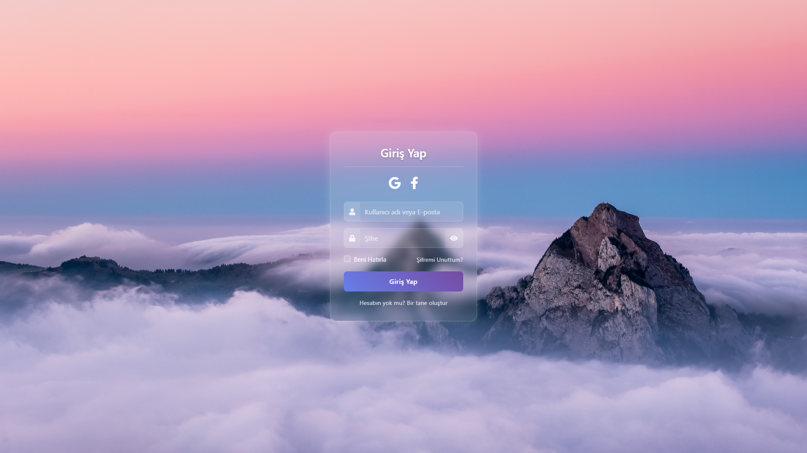
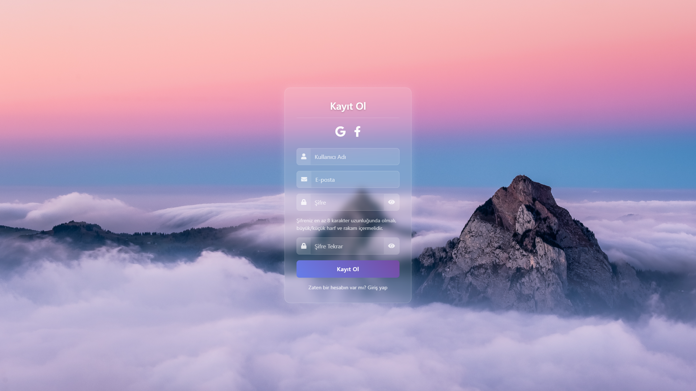
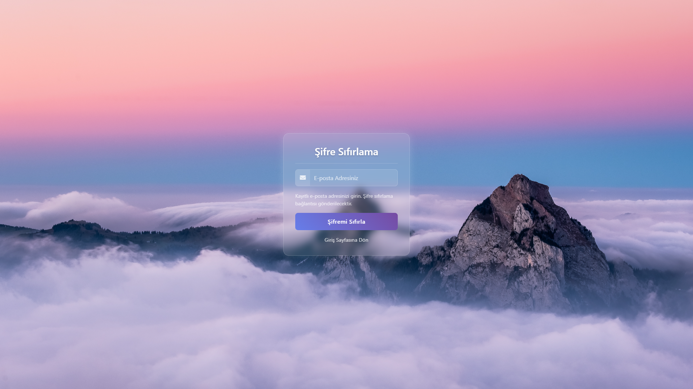

# CleanAuthKit

CleanAuthKit, kullanıcıların giriş yapabilmesi, kayıt olabilmesi ve şifrelerini sıfırlayabilmesi için modern ve şık bir tasarım sunar. Bu proje, kullanıcı dostu bir arayüz sağlar ve responsive (mobil uyumlu) tasarım ile her cihazda mükemmel görünür.

## Ekran Görüntüleri

### Giriş Yap

### Kayıt Ol

### Şifre Sıfırlama

## Kullanılan Teknolojiler

Bu projede aşağıdaki teknolojiler kullanılmıştır:

-  **HTML5**
-  **CSS3**
-  **JavaScript**
-  **Bootstrap 4.6.2**

### Özellikler

- **Responsive Tasarım:** Bu proje, mobil ve masaüstü cihazlar için uyumlu ve esnek bir tasarıma sahiptir.
- **Kullanıcı Dostu Arayüz:** Kullanıcılar, giriş yapabilir, kayıt olabilir ve şifrelerini sıfırlayabilirler.

## Lisans

Bu proje MIT Lisansı ile lisanslanmıştır. Detaylar için [LICENSE](LICENSE) dosyasına bakabilirsiniz.

